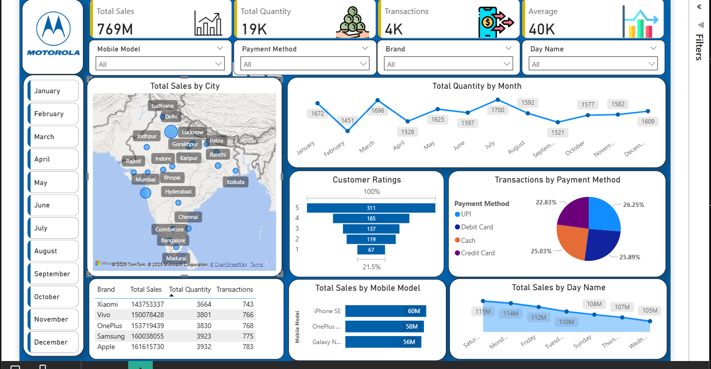

# 📱 Mobile Sales Dashboard

## 📌 Objective
To analyze mobile sales data and uncover insights into sales performance, customer behavior, and transaction trends to support data-driven decision-making and sales optimization.

---

## 📊 About Dataset
The dataset contains mobile sales transaction data across multiple cities in India.

### 📂 Key Data Includes:
- **Sales Data:** Revenue, quantity sold, number of transactions  
- **Product Details:** Mobile models and brands (Apple, Samsung, OnePlus, Xiaomi, Vivo, etc.)  
- **Customer Insights:** Ratings (1–5 scale)  
- **Payment Methods:** UPI, Debit Card, Credit Card, Cash  
- **Time Data:** Monthly and daily trends  
- **Geographical Data:** City-wise sales distribution  

👉 Enables multi-dimensional analysis across time, location, product, and customer behavior.

---

## 🛠 Tools & Technologies
- Power BI  
- Power Query (Data Cleaning & Transformation)  
- Data Visualization  

---

## 📈 Key KPIs
- **Total Sales:** 769M  
- **Total Quantity Sold:** 19K  
- **Total Transactions:** 4K  
- **Average Sales Value:** 40K  

---

## 📊 Dashboard Preview

---

## 🔍 Key Insights

### 1. Sales by City
- Major cities like Delhi, Mumbai, Bangalore, and Hyderabad dominate sales  
- Urban areas contribute the majority of revenue  

👉 **Insight:** Tier-1 cities are key revenue drivers.

---

### 2. Monthly Sales Trend
- Sales fluctuate across months  
- Peak observed during mid-year (June–August)  

👉 **Insight:** Seasonal demand significantly impacts sales.

---

### 3. Sales by Mobile Model
- iPhone SE leads in total sales (~60M)  
- OnePlus and Samsung models perform strongly  

👉 **Insight:** Premium and upper mid-range phones generate higher revenue.

---

### 4. Payment Method Analysis
- UPI and Debit Cards dominate transactions  
- Cash usage is relatively low  

👉 **Insight:** Strong shift towards digital payment methods.

---

### 5. Customer Ratings
- Majority ratings are 4 and 5  
- Indicates high customer satisfaction  

👉 **Insight:** Product quality and customer experience are positive.

---

### 6. Sales by Day
- Higher sales at the beginning of the week  
- Gradual decline mid-week  

👉 **Insight:** Consumer purchasing behavior varies across weekdays.

---

## 🚀 Features
- Interactive filters (Month, Brand, Payment Method, Model)  
- KPI cards for quick insights  
- City-wise map visualization  
- Time-based trend analysis  
- Customer and payment behavior analysis  

---

## 💡 Business Impact
- Identifies high-performing cities and products  
- Supports inventory and demand planning  
- Improves customer targeting strategies  
- Enables data-driven marketing and sales decisions  

---

## 👩‍💻 Author
Anshika Patel
